<p align="center">
  
</p>

<p align="center">
  
</p>

```console
ph20sr@github ~ $ cat sobre.txt
```

**Pedro**: desenvolvedor full stack e fundador da [**Vynex Systems**](https://vynex-systen.com.br).
Construo **sites, CRMs e sistemas de gestão** para pequenas e médias empresas: do formulário que capta o lead até a cobrança recorrente.

- 🧲 **Captação**: landing pages rápidas, formulários com atribuição de campanha e WhatsApp
- 📊 **CRM e gestão**: funil de vendas, clientes, tickets com SLA e painéis internos
- 💳 **Cobrança**: Pix, boleto e assinaturas com Asaas, webhooks idempotentes e bloqueio de inadimplentes
- 🚀 **Entrega**: hospedagem própria, migrations versionadas e CI em todo projeto

```console
ph20sr@github ~ $ ls ~/open-source
```

| Projeto | O que resolve |
| --- | --- |
| [**asaas-php**](https://github.com/Ph20sr/asaas-php) | SDK PHP do Asaas: Pix, boleto, assinaturas, webhooks idempotentes e retries que nunca duplicam cobrança |
| [**pix-brcode**](https://github.com/Ph20sr/pix-brcode) | Gera e lê o Pix copia e cola (BR Code), idêntico ao exemplo do manual do Banco Central, sem dependências |
| [**boleto-utils**](https://github.com/Ph20sr/boleto-utils) | Valida linha digitável, converte para código de barras e extrai valor e vencimento (com o novo fator de 2025) |
| [**whatsapp-cloud-php**](https://github.com/Ph20sr/whatsapp-cloud-php) | Cliente da API oficial do WhatsApp: templates, botões, mídia e webhook com assinatura verificada |
| [**webhook-relay**](https://github.com/Ph20sr/webhook-relay) | Recebe webhooks (Asaas, WhatsApp, GitHub), guarda em SQLite e reenvia com retentativas e idempotência |
| [**brasil-utils**](https://github.com/Ph20sr/brasil-utils) | CPF, **CNPJ alfanumérico (2026)**, telefone, CEP e R$, sem dependências |
| [**cep-cache**](https://github.com/Ph20sr/cep-cache) | Consulta de CEP com cache e troca automática entre ViaCEP, BrasilAPI e OpenCEP quando uma cai |
| [**status-page**](https://github.com/Ph20sr/status-page) | Página de status com 90 dias de histórico, 100% no GitHub Actions · [ao vivo](https://ph20sr.github.io/status-page/) |
| [**sla-uteis**](https://github.com/Ph20sr/sla-uteis) | Prazo de SLA em horário comercial com feriados brasileiros, pausas e status |
| [**pipeline-crm**](https://github.com/Ph20sr/pipeline-crm) | Funil de vendas kanban com previsão ponderada e alerta de negócio parado · [demo](https://ph20sr.github.io/pipeline-crm/) |
| [**lead-widget**](https://github.com/Ph20sr/lead-widget) | Captura de leads em uma tag `<script>`: UTMs, LGPD, anti-spam e fallback para WhatsApp |
| [**lgpd-consent**](https://github.com/Ph20sr/lgpd-consent) | Banner de cookies LGPD que bloqueia scripts até o consentimento e integra com o Consent Mode do Google |
| [**command-palette**](https://github.com/Ph20sr/command-palette) | Paleta Ctrl+K como Web Component, com busca fuzzy que ignora acentos |
| [**php-migrate**](https://github.com/Ph20sr/php-migrate) | Migrations SQL com checksum, lock e rollback para PHP sem framework |

```console
ph20sr@github ~ $ cat stack.txt
```

<p>
  
  
  
  
  
  
  
  
  
  
</p>

```console
ph20sr@github ~ $ ./contato.sh
```

[](https://vynex-systen.com.br)

<sub>Os cards acima são gerados por [`scripts/generate.mjs`](scripts/generate.mjs) e atualizados todo dia por um GitHub Action.</sub>
